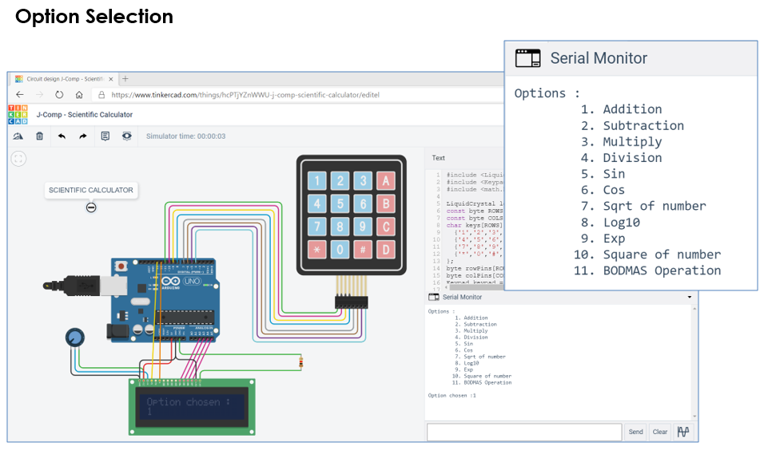

## Scientific Calculator using [Arduino Uno](https://www.arduino.cc/)

In this, we are trying to make a calculator using Arduino as microcontroller, 4x4 Keypad as input and LCD as output. This is implementated using TinkerCad Stimualtion software and Eagle EAD software for PCB Design.

### Part 1: Components

|         Components          |                  Use / Functioning                          |
|-----------------------------|-------------------------------------------------------------|
| Arduino Uno                 | Microcontroller                                             |
| LCD                         | Displaying Unit - Result                                    |
| Keypad                      | Taking Input from Users                                     |
| Potentiometer               | Setting LCD Contrast                                        |
| Resistor                    | Backlight Adjustment of LCD                                 |

### Part 2: Software Implementation

#### Operations Performed:
  - Addition, Subtraction, Multiplication and Division
  - Square root and Square of a number
  - Logarithm(base of 10) and Exponent(e^number)
  - Trigonometry (Sine and Cosine functions)
  - BODMAS operation

### Part 3: Working

After simulation, we press a no. between 1 to 11 to select an operation.

Case-1: If the selected no. is from 1 to 4 then an operation is selected, then we press any no. as the first operand and then we press “D”, so that it stop taking input for the 1st operand, then we press other no. as the second operand, then we again press “D” to stop taking input for the second operand and then the output is displayed on the LCD.

Case-2: If the selected no. is from 5 to 10 then an operation is selected, then we press any no. as the first operand and then we press “D” to stop taking input for the operand and then the output is displayed on the LCD.

Case-3: If the selected no. is equal to 11, it means we have selected the BODMAS operation, i.e. for the BODMAS operation, we first press “A”, to get input operand, then after taking 1st operand as input, we press “D”, for stop taking input for the 1st operand, then we press “C” to choose the operation to be carried out from choices 1 to 5, and then we press “D” for stop taking input for the second operand and to take the input of the next operand, and then the process is continued till the user completes giving input. At-last we press “B” to get the desired result on the LCD.

For every new computation, press D and wait till the LCD display goes blank (delay). Then, again we start by selecting any option from 1 to 11.

### Part 4: PCB Design

The PCB Designing involves 3 steps:
- Download the .BRD file from Tinkercad and Open it on EAGLE or any other EDA software
- Rearrange the components to ensure minimum space utilization
- Perform Manual Routing over the Airwires in the design

### Conclusion

Thus, we have connected and successfully demonstrated a scientific calculator with different operations as well as different number of operands with Arduino Uno using Tinkercad circuits simulator and Eagle Designing Software.
